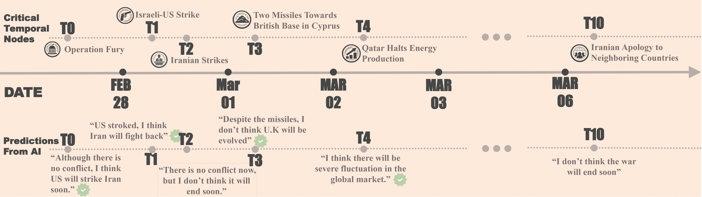

# 🌐 When AI Navigates the Fog of War

*Can AI reason about and forecast the trajectory of an ongoing war before it transitions into history?*

This is the code repository for the paper **"When AI Navigates the Fog of War"**. We present a temporally grounded benchmark that evaluates whether frontier LLMs can reason about an unfolding geopolitical conflict using only information available at each moment in time.

📄 [Paper](https://arxiv.org/abs/2603.16642) | 🖥️ [Website](https://war-forecast-arena.com) | 🤗 [Dataset](https://huggingface.co/datasets/AIcell/war-test-dataset)

<p align="center">
  
</p>

## 📖 Overview

We construct **11 critical temporal nodes** spanning the early stages of the 2026 Middle East conflict (Feb 27 – Mar 6, 2026), along with **42 node-specific verifiable questions** and **5 general exploratory questions**. At each time point, models receive only news articles published before the event and must reason about what happens next. This design substantially mitigates training-data leakage concerns, as the conflict unfolded after the training cutoff of current frontier models.

## 📋 Temporal Nodes

| Node | Date | Event | Theme | Theme Description |
|:----:|------|-------|:-----:|-------------------|
| T0 | Feb 27 | Operation Epic Fury | I | Initial Outbreak |
| T1 | Feb 28 | Israeli-US Strikes | I | Initial Outbreak |
| T2 | Feb 28 | Iranian Strikes | I | Initial Outbreak |
| T3 | Mar 1 | Two Missiles towards British Bases on Cyprus | II | Threshold Crossings |
| T4 | Mar 1 | Oil Refiner and Oil Tanker Was Attacked | III | Economic Shockwaves |
| T5 | Mar 2 | Qatar Halts Energy Production | III | Economic Shockwaves |
| T6 | Mar 2 | Natanz Nuclear Facility Damaged | II | Threshold Crossings |
| T7 | Mar 3 | U.S. Begins Evacuation of Citizens from the Middle East | II | Threshold Crossings |
| T8 | Mar 3 | Nine Countries Involved and Israeli Ground Invasion | II | Threshold Crossings |
| T9 | Mar 3 | Mojtaba Khamenei Becomes Supreme Leader | IV | Political Signaling |
| T10 | Mar 6 | Iranian Apology to Neighboring Countries | IV | Political Signaling |

## 🔍 Key Findings

1. 🧠 Current state-of-the-art LLMs often show **strong strategic reasoning**, attending to underlying incentives, deterrence pressures, and material constraints rather than surface political rhetoric.
2. ⚖️ This capability is **uneven across domains**: models are more reliable in economically and logistically structured settings than in politically ambiguous multi-actor environments.
3. 📈 Model narratives **evolve over time**, shifting from early expectations of rapid containment toward more systemic accounts of regional entrenchment and attritional de-escalation.

## 🤖 Models

All inference is routed through [OpenRouter](https://openrouter.ai/), a unified API gateway for frontier LLMs.

| Model | Provider |
|-------|----------|
| `openai/gpt-5.4` | OpenAI |
| `qwen/qwen3.5-35b-a3b` | Qwen |
| `google/gemini-3.1-flash-lite-preview` | Google |
| `anthropic/claude-sonnet-4.6` | Anthropic |
| `moonshotai/kimi-k2.5` | Moonshot |
| `minimax/minimax-m2.5` | MiniMax |

## ⚙️ Setup

```bash
pip install -r requirements.txt
```

📦 **Data** is automatically downloaded from [HuggingFace](https://huggingface.co/datasets/AIcell/war-test-dataset) on first run.

🔑 **API Key**: All API calls go through [OpenRouter](https://openrouter.ai/). Sign up for a free account and get your API key, then create `../war-prediction-LLMs/config.json` (please note that only paid account could use the full context of models):

```json
{
  "OPENROUTER_API_KEY": "your-openrouter-key"
}
```

## 🚀 Usage

```bash
# Audit data quality
python audit_data.py

# Dry run (verify prompts, no API calls)
python run_predictions.py --dry-run

# Run single model
python run_predictions.py --models openai/gpt-5.4 --time-points T3

# Full benchmark (all models, all time points)
python run_predictions.py

# Evaluate predictions
python evaluate.py

# Translate responses to Chinese
python translate.py

# Export to HuggingFace
python export_hf.py --push username/repo-name
```

## 📁 File Structure

```
war-test/
├── config.py              # API key, model list, constants, HF data loading
├── context_builder.py     # Article filtering by cutoff datetime
├── prompt_builder.py      # System + user prompt construction
├── response_parser.py     # LLM JSON response parsing
├── run_predictions.py     # Main inference pipeline (CLI)
├── evaluate.py            # Evaluate predictions via GPT-4o-mini
├── summarize_responses.py # Extract probability statements from responses
├── translate.py           # Translate responses to Chinese for better inspection
├── rerun.py               # Re-run specific failed predictions
├── run_new_question.py    # Run predictions for newly added questions
├── build_articles.py      # Build articles dataset from raw sources
├── fetch_fulltext.py      # Fetch full text for headline-only articles
├── export_hf.py           # HuggingFace dataset export
├── audit_data.py          # Data quality audit script
├── preview_prompt.py      # Preview prompts and token estimates
├── dataset/README.md      # HuggingFace dataset card
└── requirements.txt
```

## 📝 Citation

```bibtex
@misc{li2026ainavigatesfogwar,
      title={When AI Navigates the Fog of War},
      author={Ming Li and Xirui Li and Tianyi Zhou},
      year={2026},
      eprint={2603.16642},
      archivePrefix={arXiv},
      primaryClass={cs.AI},
      url={https://arxiv.org/abs/2603.16642},
}
```
